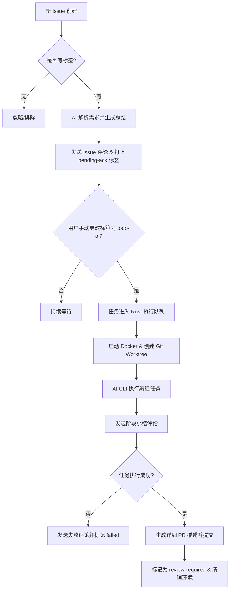
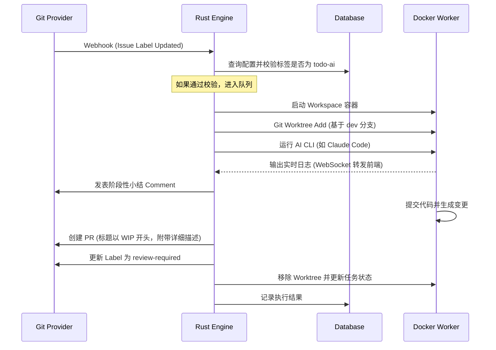

# **GitAutoDev 项目需求文档 (PRD)**

## **1\. 项目愿景**

GitAutoDev 是一个自动化编程助手系统，旨在将 Git 仓库的 Issue 直接转化为 Pull Request。通过结合 Rust 的高性能并发、Docker 的环境隔离以及 Claude Code 等 AI CLI 工具，实现端到端的开发自动化。

## **2\. 核心架构概念**

### **2.1 Workspace (工作空间 / 程序抽象)**

在本项目中，**Workspace 与 Repository (代码仓库) 在程序逻辑上是等同的抽象概念**。它是系统管理和执行任务的基本单位。

* **数据持久化**：**所有配置（包括全局凭证、Workspace 配置、任务状态）均存储在数据库中**，不再依赖本地 JSON 文件。  
* **配置聚合**：每个 Workspace 关联一个特定的代码仓库以及专属的 AI CLI 配置。  
* **全局共享凭证**：Git 提供商凭证（Gitea/GitLab/GitHub）存储在全局数据库表中。系统在执行任务时，根据仓库所属平台自动查询对应的全局凭证。  
* **独立环境**：每个 Workspace 拥有独立的 Docker 容器镜像、磁盘存储路径和环境变量。

### **2.2 Docker 隔离与 Git Worktree**

* **容器化**：每个 Workspace (Repo) 对应一个专属的 Docker 容器。  
* **并行任务**：当一个 Workspace 下有多个 Issue 同时执行时，系统在容器内通过 git worktree 为每个任务创建独立目录，互不干扰。

## **3\. 业务流程架构图**



## **4\. 功能需求**

### **4.1 仓库与分支管理 (Git Admin)**

* **源代码克隆**：初始化 Workspace 时，需先将仓库源代码 clone 到本地磁盘的 source 目录下。  
* **分支规范**：必须具备 main（主分支）与 dev（开发分支）。  
* **分支管理权限**：系统从数据库读取全局 Token，需具备分支创建、删除及推送权限。  
* **自动工作流**：从 dev 派生 feature/issue-{id}，完成后提交 PR 指向 dev。

### **4.2 标签系统与状态机 (Label System)**

标签是驱动系统状态流转的核心：

* **待确认 (pending-ack)**：系统已解析需求，等待用户审核需求总结。  
* **待开发 (todo-ai)**：用户已确认需求，系统可以开始执行。  
* **执行中 (in-progress)**：Docker 容器正在处理中。  
* **待审核 (review-required)**：已提交 PR，等待人工合并。  
* **失败 (failed)**：执行过程中出现不可恢复的错误。

**硬性过滤策略**：没有任何标签或标签不属于上述状态的 Issue 将会被系统自动排除。

### **4.3 自动化评论与反馈 (Issue Comments)**

* **执行过程同步**：在关键节点（需求确认请求、任务拾取、阶段小结、异常报错、完成提交）自动添加 Issue Comment。

### **4.4 需求确认流程 (Confirmation Flow)**

* **手动触发**：系统发表总结评论并将标签更改为 pending-ack，**提交人或管理员必须手动将 Label 修改为 todo-ai** 方可启动任务。

### **4.5 PR 提交描述规范 (PR Specifications)**

系统生成的 Pull Request 必须包含详细且结构化的描述，以便于 Reviewer 快速理解。

* **标题格式**：WIP: Auto-fix: \#{issue\_id} {issue\_title}。（注：增加 **WIP** 前缀以标示为自动生成的待处理草案）  
* **描述正文 (模板)**：包含 Summary（摘要）、Changes（文件清单）、AI Reasoning（决策逻辑）和 Self-Check（自检结果）。  
* **关联逻辑**：必须包含 Closes \#{issue\_id} 以便自动关闭 Issue。

### **4.6 前端管理后台 (Dashboard)**

使用 **React \+ Tailwind CSS \+ Bun** 构建：包含凭证管理（全局）、Workspace 管理、看板视图与实时 WebSocket 监控。

## **5. 技术栈细节**

| 模块 | 技术选型 | 备注 |  
| --- | --- | --- |
| 后端 | Rust (Axum + Tokio) | 核心逻辑、Docker 调度、数据库交互 |  
| 数据库 | SQLite / PostgreSQL | 存储配置与执行历史 |  
| 部署方式 | Docker Compose | 实现服务、数据库与 Docker-in-Docker 的统一编排 |  
| 虚拟化 | Docker + Bollard | 基于 Workspace 的环境隔离 |

## **6\. 存储与目录结构**

### **6.1 数据库结构 (关系型)**

* **Table: global_credentials**: 全局 Git Token 与 Provider 配置。  
* **Table: workspaces**: 仓库信息与 AI CLI 参数。  
* **Table: tasks**: 任务状态、Issue 关联及历史记录。

### **6.2 磁盘文件结构**

```plaintext
/data/gitautodev/  
├── db/             \# 如果使用 SQLite，存储数据库文件  
└── storage/        \# 仓库持久化存储  
    └── {workspace\_id}/  
        ├── source/     \# 源码主库 (git clone 目标)  
        └── worktrees/  \# 任务并行执行区  
            ├── task-101/  
            └── task-102/
```

## **7\. 部署规范 (Docker Compose)**

为了确保系统的快速部署与环境一致性，提供 docker-compose.yml 模板。

* **服务编排**：gitautodev-api, gitautodev-ui, postgres。  
* **挂载要求**：  
  * **Docker Socket**: /var/run/docker.sock（实现 Rust 对宿主机 Docker 的控制）。  
  * **Data Volume**: /data/gitautodev（确保代码库与数据库持久化）。

## **8\. 核心业务流程 (Flow)**



1. **扫描/监听**：系统监控已激活 Workspace 的 Issue 动态。  
2. **需求预审**：AI 生成总结 \-\> 自动打上 pending-ack 标签 \-\> 发表评论。  
3. **用户确认**：用户手动将标签改为 todo-ai。  
4. **状态入库**：系统在数据库中将任务标记为待处理。  
5. **环境准备**：启动 Docker，基于 source 创建 worktree 目录。  
6. **AI 执行**：运行 CLI 工具，期间持续发表小结评论及推送 WebSocket 日志。  
7. **提交 PR**：生成 WIP 标题的 PR，推送代码并更新状态。  
8. **清理**：任务结束，关闭并移除临时磁盘目录。

## **9\. 未来扩展**

* **执行历史溯源**。  
* **安全沙箱**：进一步限制容器的网络与系统权限。
