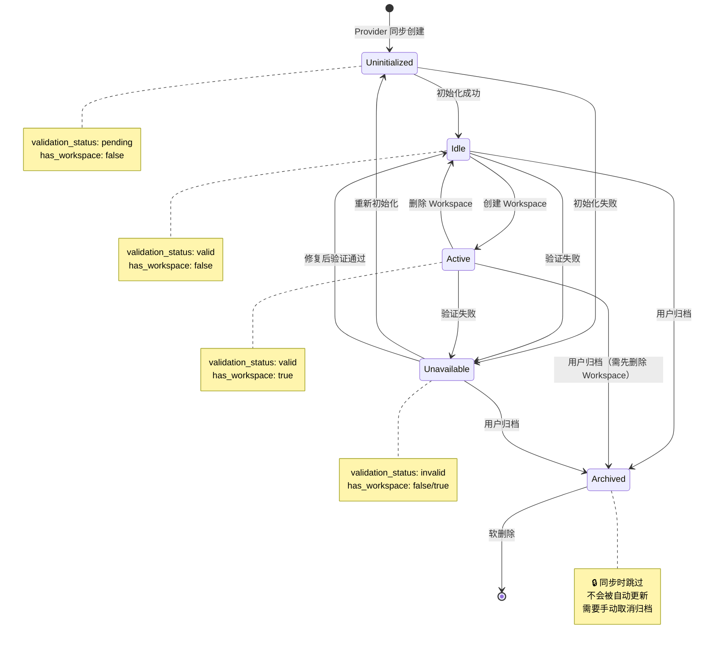

# Repository 管理功能设计文档

**版本**: v1.0  
**日期**: 2026-01-17  
**状态**: 设计阶段 - 待审核  
**作者**: AI Assistant (OpenCode)

## 目录

1. [概述](#概述)
2. [背景和动机](#背景和动机)
3. [核心设计决策](#核心设计决策)
4. [状态机设计](#状态机设计)
5. [软删除与同步策略](#软删除与同步策略)
6. [归档功能设计](#归档功能设计)
7. [批量操作设计](#批量操作设计)
8. [与 Workspace 的集成](#与-workspace-的集成)
9. [风险和缓解措施](#风险和缓解措施)
10. [参考资料](#参考资料)

---

## 概述

本文档描述了 GitAutoDev 项目中 Repository 管理功能的完整设计方案。该功能旨在提供完整的仓库生命周期管理能力，包括状态管理、软删除、归档、批量操作等。

### 设计目标

1. **完整的 CRUD 操作**：支持创建、读取、更新、删除仓库记录
2. **清晰的状态管理**：5种状态覆盖仓库完整生命周期
3. **软删除机制**：防止误删，支持自动恢复
4. **批量操作**：提高大规模管理效率
5. **同步兼容性**：软删除后重新同步能正确处理

### 设计原则

- **用户体验优先**：操作简单直观，符合用户心智模型
- **数据安全**：软删除防止误删，归档保护历史数据
- **性能优化**：归档仓库不参与同步，减少不必要的操作
- **可扩展性**：为未来的 Workspace 集成预留接口

---

## 背景和动机

### 当前问题

GitAutoDev v0.1.20 的 Repository 管理功能存在以下限制：

1. **只能创建，不能删除**：通过 Provider 同步创建的仓库无法删除
2. **无状态管理**：无法区分"未初始化"、"闲置"、"活动"等状态
3. **无批量操作**：管理大量仓库效率低下
4. **无归档功能**：历史项目无法归档，影响列表可读性

### 用户场景

**场景 1：初次设置**

```
用户添加 Gitea Provider → 同步了 50 个仓库
问题：只想对其中 5 个启用自动化
需求：批量初始化选中的仓库，归档其他仓库
```

**场景 2：团队重组**

```
某个团队的 10 个仓库不再需要自动化
需求：批量归档这些仓库
```

**场景 3：误删恢复**

```
用户误删了一个仓库
需求：Provider 同步时自动恢复
```

---

## 核心设计决策

### 决策 1：软删除策略

**决策**：实施软删除，使用 `deleted_at` 字段标记

**理由**：

- ✅ 防止误删除导致数据丢失
- ✅ 保留历史记录用于审计
- ✅ 支持自动恢复（Provider 同步时）

**实现**：

```rust
pub struct Model {
    // ... 其他字段
    pub deleted_at: Option<DateTimeUtc>,
}

// 软删除
async fn soft_delete(repo_id: i32) {
    repo.deleted_at = Some(Utc::now());
    repo.save().await?;
}

// 恢复
async fn restore(repo_id: i32) {
    repo.deleted_at = None;
    repo.status = RepositoryStatus::Uninitialized;
    repo.save().await?;
}
```

**同步处理**：

```rust
// Provider 同步时
if repo.deleted_at.is_some() {
    // 软删除的记录 → 自动恢复
    repo.restore().await?;
}
```

### 决策 2：5种状态管理

**决策**：引入 5 种状态覆盖完整生命周期

| 状态 | 说明 | 典型场景 |
|------|------|---------|
| `uninitialized` | 未初始化 | 刚从 Provider 同步 |
| `idle` | 闲置 | 已初始化但未关联 Workspace |
| `active` | 活动 | 已关联 Workspace，处理 Issue |
| `unavailable` | 不可用 | 验证失败或权限不足 |
| `archived` | 归档 | 不再使用，只读 |

**理由**：

- ✅ 清晰的语义，易于理解
- ✅ 覆盖完整生命周期
- ✅ 支持自动状态转换
- ✅ 为 Workspace 集成预留接口

### 决策 3：归档同步过滤

**决策**：归档的仓库在 Provider 同步时跳过，不更新

**理由**：

- ✅ 尊重用户的归档决定
- ✅ 减少不必要的数据库写入
- ✅ 提高同步性能
- ✅ 避免意外覆盖归档仓库的配置

**实现**：

```rust
async fn sync_repository(provider_id: i32, git_repo: GitRepository) {
    let existing = find_repository(provider_id, &git_repo.full_name).await?;
    
    if let Some(repo) = existing {
        // 归档的仓库 → 跳过
        if repo.status == RepositoryStatus::Archived {
            log::debug!("Skipping archived repository: {}", repo.full_name);
            return Ok(());
        }
        
        // 软删除的仓库 → 恢复
        if repo.deleted_at.is_some() {
            repo.restore().await?;
        }
        
        // 正常仓库 → 更新
        repo.update_metadata(&git_repo).await?;
    }
}
```

### 决策 4：批量操作策略

**决策**：采用"部分成功"模式，返回详细结果

**理由**：

- ✅ 不会因为一个失败导致全部回滚
- ✅ 用户可以看到哪些成功、哪些失败
- ✅ 适合大批量操作

**响应格式**：

```json
{
  "total": 3,
  "succeeded": 2,
  "failed": 1,
  "results": [
    {
      "repository_id": 1,
      "repository_name": "owner/repo-1",
      "success": true,
      "error": null
    },
    {
      "repository_id": 2,
      "repository_name": "owner/repo-2",
      "success": true,
      "error": null
    },
    {
      "repository_id": 3,
      "repository_name": "owner/repo-3",
      "success": false,
      "error": "Cannot archive repository with active workspace"
    }
  ]
}
```

---

## 状态机设计

### 状态转换图



### 状态转换规则

| 当前状态 | 操作 | 目标状态 | 前置条件 | 触发方式 |
|---------|------|---------|---------|---------|
| Uninitialized | 初始化 | Idle | 验证通过 | 手动/批量 |
| Uninitialized | 初始化 | Unavailable | 验证失败 | 自动 |
| Idle | 创建 Workspace | Active | 验证有效 | Workspace 模块 |
| Active | 删除 Workspace | Idle | 无 | Workspace 模块 |
| Active | 归档 | Archived | 需先删除 Workspace | 手动 |
| Unavailable | 重新初始化 | Uninitialized | 无 | 手动 |
| Archived | 取消归档 | Idle/Unavailable | 无 | 手动 |
| * | 验证失败 | Unavailable | 任何状态 | 自动 |
| * | 软删除 | (deleted) | 无 Workspace | 手动 |

### 自动状态转换

系统会在以下情况自动更新状态：

1. **Provider 同步**：
   - 新仓库 → `Uninitialized`
   - 恢复软删除的仓库 → `Uninitialized`

2. **初始化完成**：
   - 验证通过 → `Idle`
   - 验证失败 → `Unavailable`

3. **Workspace 生命周期**：
   - 创建 Workspace → `Active`
   - 删除 Workspace → `Idle`

4. **验证刷新**：
   - 从 `valid` 变为 `invalid` → `Unavailable`
   - 从 `invalid` 变为 `valid` → `Idle` (如果无 Workspace)

---

## 软删除与同步策略

### 软删除机制

**目的**：防止误删，支持恢复

**实现**：

```rust
// 软删除
pub async fn soft_delete(&self, repo_id: i32) -> Result<()> {
    let repo = Repository::find_by_id(repo_id).await?;
    
    // 检查：不能删除有 Workspace 的仓库
    if repo.has_workspace {
        return Err(GitAutoDevError::Conflict(
            "Cannot delete repository with workspace"
        ));
    }
    
    // 设置 deleted_at
    repo.deleted_at = Some(Utc::now());
    repo.save().await?;
    
    Ok(())
}
```

### 同步恢复策略

**问题**：软删除后，Provider 同步时如何处理？

**解决方案**：自动恢复

```rust
async fn sync_repository(provider_id: i32, git_repo: GitRepository) -> Result<()> {
    // 查找时包含已删除的记录
    let existing = Repository::find_by_provider_and_full_name(
        provider_id,
        &git_repo.full_name,
        include_deleted: true,
        include_archived: true,
    ).await?;
    
    if let Some(repo) = existing {
        // 1. 归档的仓库 → 跳过
        if repo.status == RepositoryStatus::Archived {
            return Ok(());
        }
        
        // 2. 软删除的仓库 → 恢复
        if repo.deleted_at.is_some() {
            repo.restore().await?;
            log::info!("Restored deleted repository: {}", repo.full_name);
        } else {
            // 3. 正常仓库 → 更新元数据
            repo.update_metadata(&git_repo).await?;
        }
    } else {
        // 4. 不存在 → 创建新记录
        Repository::create(provider_id, &git_repo).await?;
    }
    
    Ok(())
}
```

### 唯一性约束处理

**问题**：SQLite 不支持带 WHERE 子句的部分唯一索引

**解决方案**：在应用层处理

```rust
// 查找时排除已删除的记录
let existing = Repository::find()
    .filter(repository::Column::ProviderId.eq(provider_id))
    .filter(repository::Column::FullName.eq(&full_name))
    .filter(repository::Column::DeletedAt.is_null())  // 关键
    .one(&db)
    .await?;
```

**PostgreSQL 方案**（生产环境）：

```sql
CREATE UNIQUE INDEX idx_repositories_provider_fullname_active 
ON repositories(provider_id, full_name) 
WHERE deleted_at IS NULL;
```

---

## 归档功能设计

### 归档语义

**归档 = "封存"**：

- 不再使用
- 只读状态
- 不参与同步
- 保留历史记录

### 归档 vs 软删除

| 维度 | 归档 (Archived) | 软删除 (Deleted) |
|------|----------------|-----------------|
| **用户意图** | "不再使用，但保留记录" | "删除了，但可能误删" |
| **同步行为** | 跳过，不更新 | 自动恢复 |
| **可见性** | 可见（需过滤查看） | 默认不可见 |
| **可恢复性** | 需要手动取消归档 | 自动恢复 |
| **典型场景** | 历史项目、已下线服务 | 误删、临时清理 |

### 归档操作

**归档**：

```rust
pub async fn archive_repository(&self, repo_id: i32) -> Result<repository::Model> {
    let repo = Repository::find_by_id(repo_id).await?;
    
    // 检查：不能归档有 Workspace 的仓库
    if repo.has_workspace {
        return Err(GitAutoDevError::Conflict(
            "Cannot archive repository with workspace. Delete workspace first."
        ));
    }
    
    // 检查：已归档的仓库不能再次归档
    if repo.status == RepositoryStatus::Archived {
        return Err(GitAutoDevError::Conflict("Repository already archived"));
    }
    
    // 更新状态
    repo.status = RepositoryStatus::Archived;
    repo.save().await?;
    
    Ok(repo)
}
```

**取消归档**：

```rust
pub async fn unarchive_repository(&self, repo_id: i32) -> Result<repository::Model> {
    let repo = Repository::find_by_id(repo_id).await?;
    
    // 检查：只能取消归档已归档的仓库
    if repo.status != RepositoryStatus::Archived {
        return Err(GitAutoDevError::Conflict("Repository is not archived"));
    }
    
    // 重新验证状态
    let new_status = if repo.validation_status == ValidationStatus::Valid {
        RepositoryStatus::Idle
    } else {
        RepositoryStatus::Unavailable
    };
    
    repo.status = new_status;
    repo.save().await?;
    
    Ok(repo)
}
```

### 归档仓库的操作限制

**完全只读**：

```rust
async fn check_not_archived(repo: &Repository) -> Result<()> {
    if repo.status == RepositoryStatus::Archived {
        return Err(GitAutoDevError::Conflict(
            "Cannot modify archived repository. Unarchive it first."
        ));
    }
    Ok(())
}

// 应用到所有修改操作
async fn update_repository(...) {
    check_not_archived(&repo).await?;
    // ... 执行更新
}

async fn initialize_repository(...) {
    check_not_archived(&repo).await?;
    // ... 执行初始化
}

async fn refresh_repository(...) {
    check_not_archived(&repo).await?;
    // ... 执行刷新
}
```

---

## 批量操作设计

### 支持的批量操作

1. **批量初始化**（已有）
2. **批量归档**
3. **批量删除**
4. **批量刷新验证**
5. **批量重新初始化**

### 批量操作响应模型

```rust
#[derive(Debug, Serialize, Deserialize, ToSchema)]
pub struct BatchOperationResponse {
    /// 总数
    pub total: usize,
    /// 成功数
    pub succeeded: usize,
    /// 失败数
    pub failed: usize,
    /// 详细结果
    pub results: Vec<BatchOperationResult>,
}

#[derive(Debug, Serialize, Deserialize, ToSchema)]
pub struct BatchOperationResult {
    pub repository_id: i32,
    pub repository_name: String,
    pub success: bool,
    pub error: Option<String>,
}
```

### 批量操作实现模式

```rust
pub async fn batch_archive(
    &self,
    repo_ids: Vec<i32>,
) -> Result<BatchOperationResponse> {
    let total = repo_ids.len();
    let mut succeeded = 0;
    let mut failed = 0;
    let mut results = Vec::new();
    
    for repo_id in repo_ids {
        // 查找仓库
        let repo = match Repository::find_by_id(repo_id).await {
            Ok(Some(r)) => r,
            Ok(None) => {
                results.push(BatchOperationResult {
                    repository_id: repo_id,
                    repository_name: format!("repo-{}", repo_id),
                    success: false,
                    error: Some("Repository not found".to_string()),
                });
                failed += 1;
                continue;
            }
            Err(e) => {
                results.push(BatchOperationResult {
                    repository_id: repo_id,
                    repository_name: format!("repo-{}", repo_id),
                    success: false,
                    error: Some(e.to_string()),
                });
                failed += 1;
                continue;
            }
        };
        
        // 执行归档
        match self.archive_repository(repo_id).await {
            Ok(_) => {
                results.push(BatchOperationResult {
                    repository_id: repo_id,
                    repository_name: repo.full_name.clone(),
                    success: true,
                    error: None,
                });
                succeeded += 1;
            }
            Err(e) => {
                results.push(BatchOperationResult {
                    repository_id: repo_id,
                    repository_name: repo.full_name.clone(),
                    success: false,
                    error: Some(e.to_string()),
                });
                failed += 1;
            }
        }
    }
    
    Ok(BatchOperationResponse {
        total,
        succeeded,
        failed,
        results,
    })
}
```

---

## 与 Workspace 的集成

### 当前状态

- Workspace 模块尚未实现（标记为 planned）
- 关系：Repository → Workspace (一对一)

### 集成点设计

**1. Workspace 创建时**：

```rust
async fn create_workspace(repo_id: i32) -> Result<Workspace> {
    let repo = Repository::find_by_id(repo_id).await?;
    
    // 检查状态
    if repo.status != RepositoryStatus::Idle {
        return Err(GitAutoDevError::Validation(
            "Repository must be in idle status to create workspace"
        ));
    }
    
    // 创建 Workspace
    let workspace = Workspace::create(repo_id).await?;
    
    // 更新 Repository 状态
    repo.status = RepositoryStatus::Active;
    repo.has_workspace = true;
    repo.save().await?;
    
    Ok(workspace)
}
```

**2. Workspace 删除时**：

```rust
async fn delete_workspace(workspace_id: i32) -> Result<()> {
    let workspace = Workspace::find_by_id(workspace_id).await?;
    let repo = Repository::find_by_id(workspace.repo_id).await?;
    
    // 删除 Workspace
    workspace.delete().await?;
    
    // 更新 Repository 状态
    repo.status = RepositoryStatus::Idle;
    repo.has_workspace = false;
    repo.save().await?;
    
    Ok(())
}
```

### 预留接口

```rust
impl Repository {
    /// 检查是否可以创建 Workspace
    pub fn can_create_workspace(&self) -> bool {
        self.status == RepositoryStatus::Idle
            && self.validation_status == ValidationStatus::Valid
            && !self.has_workspace
    }
    
    /// 检查是否可以删除
    pub fn can_delete(&self) -> bool {
        !self.has_workspace
    }
    
    /// 检查是否可以归档
    pub fn can_archive(&self) -> bool {
        self.status != RepositoryStatus::Active || !self.has_workspace
    }
}
```

---

## 风险和缓解措施

### 风险 1：数据迁移失败

**风险**：现有数据的状态初始化可能不准确

**影响**：中等 - 可能导致状态不一致

**缓解措施**：

- ✅ 迁移脚本使用保守的逻辑
- ✅ 提供数据验证工具
- ✅ 在测试环境充分验证
- ✅ 准备回滚方案

### 风险 2：同步冲突

**风险**：软删除后同步可能导致意外恢复

**影响**：低 - 用户可能困惑

**缓解措施**：

- ✅ 清晰的日志记录
- ✅ UI 中显示"已恢复"提示
- ✅ 提供永久删除选项（管理员）

### 风险 3：性能影响

**风险**：批量操作可能影响系统性能

**影响**：中等 - 可能导致响应变慢

**缓解措施**：

- ✅ 限制批量操作的数量（如最多 100 个）
- ✅ 考虑异步处理大批量操作
- ✅ 添加速率限制

### 风险 4：状态不一致

**风险**：has_workspace 字段可能与实际不同步

**影响**：高 - 可能导致数据不一致

**缓解措施**：

- ✅ 在 Workspace CRUD 操作中严格更新
- ✅ 提供一致性检查工具
- ✅ 定期后台任务验证

---

## 参考资料

### 业界最佳实践

1. **GitHub 的归档仓库**
   - 归档后完全只读
   - 默认不显示在列表
   - 可以取消归档

2. **Gmail 的归档邮件**
   - 从收件箱消失
   - 可以通过搜索找到
   - 可以"移回收件箱"

3. **Jira 的归档项目**
   - 默认不显示
   - 只读状态
   - 可以恢复

### 相关文档

- [INIT-PRD.md](../INIT-PRD.md) - 项目需求文档
- [AGENTS.md](../../AGENTS.md) - 开发指南
- [vibe-kanban Repository 管理](https://deepwiki.com/BloopAI/vibe-kanban) - 参考实现

### 技术栈

- **SeaORM 0.12** - ORM 框架
- **Axum 0.7** - Web 框架
- **SQLite/PostgreSQL** - 数据库
- **utoipa 4.x** - OpenAPI 文档

---

## 附录

### A. 状态转换完整矩阵

| 从 \ 到 | Uninitialized | Idle | Active | Unavailable | Archived |
|---------|--------------|------|--------|-------------|----------|
| **Uninitialized** | - | ✅ 初始化 | ❌ | ✅ 验证失败 | ✅ 归档 |
| **Idle** | ❌ | - | ✅ 创建 WS | ✅ 验证失败 | ✅ 归档 |
| **Active** | ❌ | ✅ 删除 WS | - | ✅ 验证失败 | ⚠️ 需先删除 WS |
| **Unavailable** | ✅ 重新初始化 | ✅ 修复验证 | ❌ | - | ✅ 归档 |
| **Archived** | ❌ | ✅ 取消归档 | ❌ | ✅ 取消归档 | - |

### B. API 端点清单

**单个操作**：

- `PATCH /api/repositories/:id` - 更新元数据
- `POST /api/repositories/:id/archive` - 归档
- `POST /api/repositories/:id/unarchive` - 取消归档
- `DELETE /api/repositories/:id` - 软删除
- `POST /api/repositories/:id/reinitialize` - 重新初始化

**批量操作**：

- `POST /api/repositories/batch-archive` - 批量归档
- `POST /api/repositories/batch-delete` - 批量删除
- `POST /api/repositories/batch-refresh` - 批量刷新
- `POST /api/repositories/batch-reinitialize` - 批量重新初始化

**查询增强**：

- `GET /api/repositories?status=idle&has_workspace=false&search=test`

### C. 数据库字段清单

**新增字段**：

- `status` (TEXT, NOT NULL, DEFAULT 'uninitialized')
- `has_workspace` (BOOLEAN, NOT NULL, DEFAULT FALSE)
- `deleted_at` (TIMESTAMP, NULL)

**新增索引**：

- `idx_repositories_status`
- `idx_repositories_deleted_at`
- `idx_repositories_has_workspace`

---

**文档结束**
